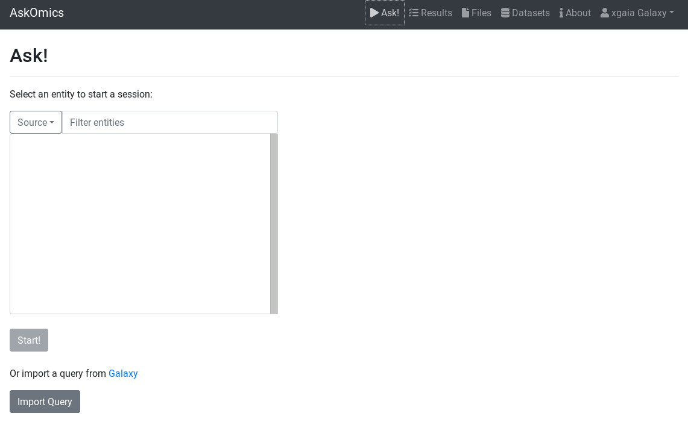
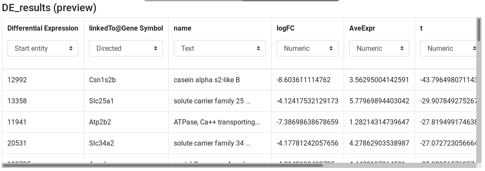
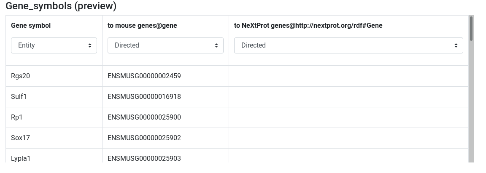

# Introduction
{:.no_toc}

<!-- AskOmics intro -->
AskOmics is a web software for data integration and query using the Semantic Web. It helps users to convert multiple data sources (CSV/TSV files, GFF annotation) into RDF triples, and perform complex queries using a user-friendly interface.

<!-- AskOmics for RNA-Seq -->
AskOmics comes useful for cross-referencing results datasets with reference data. In RNA-Seq studies, we often need to ...

<!-- The data -->
In this tutorial, We will use a file of differentially expressed results. This file is provided for you here. To generate the file yourself, see the [RNA-Seq counts to gene]({{ site.baseurl }}) tutorial. The file used here was generated from limma-voom but you could use a file from any RNA-seq differential expression tool, such as edgeR or DESeq2, as long as it has the required columns (see below).

The differentially expressed results will be crossed with mouse genome annotation, in GFF format (general feature format). This provided is a subset of the mouse annotation (GRCm38.p6) provided by [Ensembl](http://www.ensembl.org/Mus_musculus/Info/Index).

In the differentially expressed file, gene are described by a symbol. In the annotation file, its an ensembl id. To link the 2 datasets, we will need a file to map the gene symbol with Ensembl id.

Finally, we'll integrate a file about quantitative trait loci (QTL) to find if our differentially expressed genes are located inside QTL. This file is a subset of result query of (http://www.informatics.jax.org).


> ### Agenda
>
> In this tutorial, we will cover:
>
> 1. TOC
> {:toc}
>
{: .agenda}

# Preparing the inputs

We will use four files for this analysis:

 * **Differentially expressed results file** (genes in rows, and 4 required columns: identifier (ENTREZID) ,gene symbol (SYMBOL), log fold change (logFC) and adjusted P values (adj.P.Val))
 * **Reference genome annotation file** (in GFF format)
 * **Correspondence file between gene symbol and Ensembl id** (TSV of two columns: symbol and the corresponding Ensembl id)
 * **QTL file** (QTL in row, with ? required columns: identifier, chromosome, start and end)

## Import data

> ###  Hands-on: Data upload
>
> 1. Create a new history for this RNA-seq exercise e.g. `RNA-seq AskOmics`
>
>    
>    
>
> 2. Import the files.
>
>    To import the files, there are two options:
>    - Option 1: From a shared data library if available (ask your instructor)
>    - Option 2: From [Zenodo](https://zenodo.org/record/3601076)
>
>    
>    
>
>    - You can paste the links below into the **Paste/Fetch** box:
>
>      ```
>      https://zenodo.org/record/2529117/files/limma-voom_luminalpregnant-luminallactate
>      https://zenodo.org/record/3601076/files/Mus_musculus.GRCm38.98.subset.gff3
>      https://zenodo.org/record/3601076/files/symbol-ensembl.tsv
>      https://zenodo.org/record/3601076/files/MGIBatchReport_Qtl_Subset.txt
>      ```
>
> 2. Rename the files using the  (pencil) icon.
>    - limma-voom_luminalpregnant-luminallactate to `DE results`
>    - Mus_musculus.GRCm38.98.subset.gff3 to `Mus musculus annotation`
>    - symbol-ensembl.tsv to `symbol to Ensembl`
>    - MGIBatchReport_Qtl_Subset.txt to `QTL`
>
> 3. Check every datatype.
>    - DE results: `tabular`
>    - Mus musculus annotation: `gff`
>    - symbol to Ensembl: `tabular`
>    - QTL: `tabular`
>
> If the datatypes are wrong, please change it.
>
> 
{: .hands_on}

Click on the  (eye) icon and take a look at the uploaded files.

# Upload inputs into AskOmics

## Launch AskOmics Interactive Tool

> ###  Hands-on: Launch AskOmics IT
> 1. **AskOmics** a visual SPARQL query builder  to launch the Interactive Tool
>    -  *"A dataset to load into AskOmics"*: `DE results`
{: .hands_on}

Wait for view until the tool is available. click on the link to display the tool.




Once the Interactive Tool is launched, AskOmics .. the start page. You can see that their is no data yet. Next step is to upload data

## Upload files from Galaxy to AskOmics

> ###  Hands-on: Upload files into AskOmics
> 1. **Files** page to see the uploaded files. There is only `DE results` for now.
> 2. **Galaxy**: select the `RNA-Seq AskOmics` history and select all files except `DE results`
> 3. **Upload**
{: .hands_on}


Now that all the files are on the AskOmics server, its time to integrate them!

# Convert inputs into RDF

AskOmics conversion into RDF is called *integration*.

## Integrate files into RDF graphs

> ###  Hands-on: Integrate data
> 1. **Files** page, select all the input files
> 2. **Integrate**
{: .hands_on}

The **Integrate** page show a preview of the data present in the file depending of the data type.

### Integrate GFF files

The GFF preview show the entities that the file contain. We can select the entity we want to be integrated.

> ###  Hands-on: Integrate `Mus musculus annotation.gff3`
> 1. Select `gene` and `mRNA`
> 2. **Integrate (private dataset)**
>  
{: .hands_on}

### Integration of TSV files

The TSV preview show an HTML table representing the TSV file. During integration, AskOmics we will convert the file content and .. using the header of the file.

<!-- First col: entity, then, attribute -->
The first column of a TSV file will be an *entity*. Other columns of the file will be *attributes* of the *entity*. *Labels* of the *entity* and *attributes* will be set by the header. This *labels* can be edited by clicking on it.  

<!-- Attribute types -->
Entity and attributes can have special types. The types are defined with the select below the header. An *entity* can be a *start entity* or an *entity*. A *start entity* mean that the entity may be used to start a query.

Attributes can take the following types:
- Numeric: if all the values are numeric
- Text: if all the values are strings
- Category: if there is a limited number of repeated values

If the entity describe a locatable element on a genome:
- Reference: chromosome
- Strand: strand
- Start: start position
- End: end position

<!-- Relation -->
A columns can also be a relation between the entity to another. In this case, the header have to be `relationName@TargetedEntity` and the type *Directed* or *Symmetric* relation.

> ###  Hands-on: Integrate `DE results`
> 1. Search for `DE results (preview)`
> 2. Edit the header and the types:
>   - change `ENTREZ ID` to `Differential Expression` and set type to *start entity*
>   - change `SYMBOL` to `linkedTo@GeneLink` and set type to *Symmetric relation*
>   - change `GENENAME` to `name` and set type to *text*
>   - Keep the other column names and set their types to *numeric*
> 3. **Integrate (private dataset)**
>   
{: .hands_on}

> ###  Hands-on: Integrate `Symbol to Ensembl`
> 1. Search for `Symbol to Ensembl (preview)`
> 2. Edit the header and the types:
>   - change `symbol` to `GeneLink` and set type to *start entity*
>   - change `ensembl` to `linkedTo@gene` and set type to *Symmetric relation*
> 3. **Integrate (private dataset)**
>   
{: .hands_on}

> ###  Hands-on: Integrate `QTL`
> 1. Search for `QTL (preview)`
> 2. Edit the header and the types:
>   - change `Input` to `QTL` and set type to *start entity*
>   - set `Chr` type to *Reference*
>   - set `Start` type to *Start*
>   - set `End` type to *End*
> 3. **Integrate (private dataset)**
>   
{: .hands_on}

Integration can take some times depending on the file size. The **Datasets** page show the progress.

> ###  Hands-on: track integration progress
> 1. Go to **Dataset** page
> 2. Wait for all datasets to be *success*
>   
{: .hands_on}

# Query

Once all the data of interest are integrated (converted to RDF graphs), its time to query them. Querying rdf data is done by the SPARQL language. AskOmics have a user-friendly interface to build SPARQL queries without knowing SPARQL language.

## Simple queries


The first step for building a query is to start by a node of interest.

> ###  Hands-on: Start a query
> 1. Go to **Ask!** page
> 2. Select the *Differential Expression* entity
> 3. **Start!**
{: .hands_on}


Once the start entity is chosen, the query builder is displayed.


The query builder is composed of a graph. Nodes are entities and links are relations between entities. The selected entity is surrounded by a red circle. links and other entities are dotted and lighter because there are not instantiated.

On the right, attributes of the selected entity are displayed as attribute boxes. Each boxes have an eye icon. Open eye mean the attribute will be displayed on the results.

> ###  Hands-on: Ask for all Differential Expression and display some attributes
> 1. Display `logFC` and `adj.P.val` by clicking on the eye icon
> 2. **Run & preview**
{: .hands_on}

